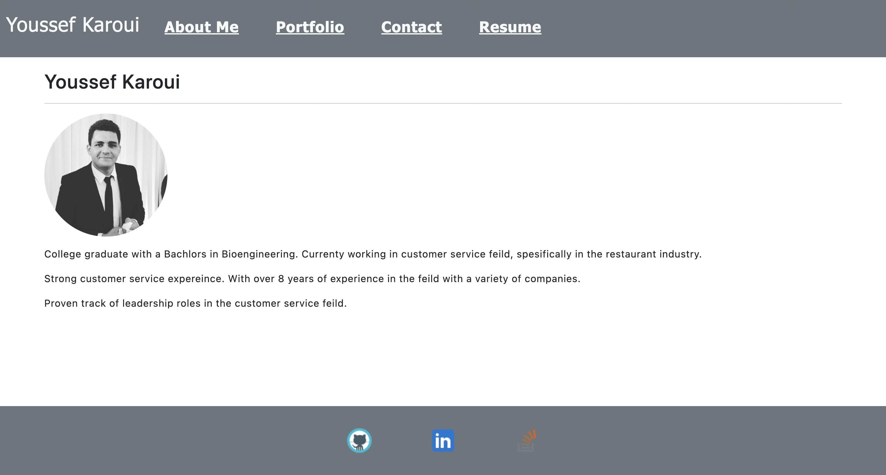

# React-Portfolio
 
  

This React-Portfolio is a place where I can show all the projects that I have worked on so far to potential employers as well as my fellow developers and collaborators. It also shows my React skills to employers that are looking for developers that master the latest technologies out there.
  
  
  

  ## Table of Contents

  - [Installation](#installation)
  - [Usage](#usage)
  - [Contribution](#contribution)
  - [Deployment](#deployment)
  - [Testing](#testing)
  - [License](#license)
  - [Questions](#questions)

  
  ## Installation

  Clone the repository on your local machine and run `npm i`, `npm start`.

  

  ## Usage
  Run the application on your local machine and navigate to your default browser to see the deployment or you can just access the deployment link in the Deployment section.
  

  ## Contribution 

  Please create an issue first.

  

  ## Deployment 

  [Here's a link to github pages](youssefkaroui.github.io/react-portfolio/)

  

  ## Testing 

  Run `npm run test'

  

  ## License 

     Copyright 2023 Youssef Karoui    Permission is hereby granted, free of charge, to any person obtaining a copy of this software and associated documentation files (the “Software”), to deal in the Software without restriction, including without limitation the rights to use, copy, modify, merge, publish, distribute, sublicense, and/or sell copies of the Software, and to permit persons to whom the Software is furnished to do so, subject to the following conditions: The above copyright notice and this permission notice shall be included in all copies or substantial portions of the Software.

  If you would like to know more about licensing information here's a link for more details: https://opensource.org/license/mit/

  

  ## Questions 

  [Email me if you have any questions](mailto:youssefkaroui6@gmail.com)

[Review my other projects on GitHub.](https://www.github.com/youssefkaroui)

  